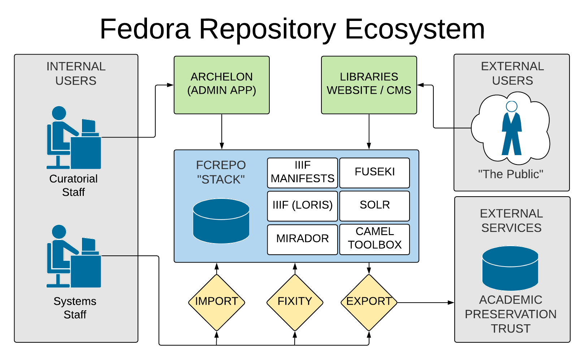
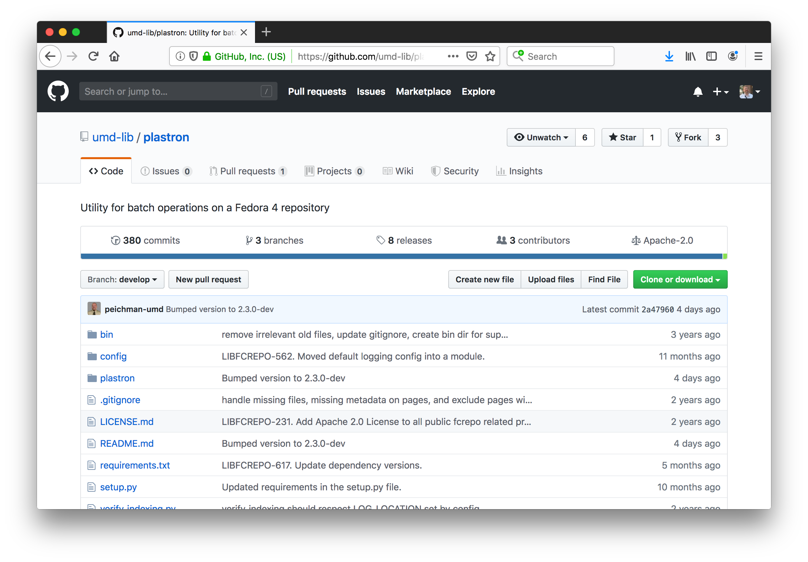
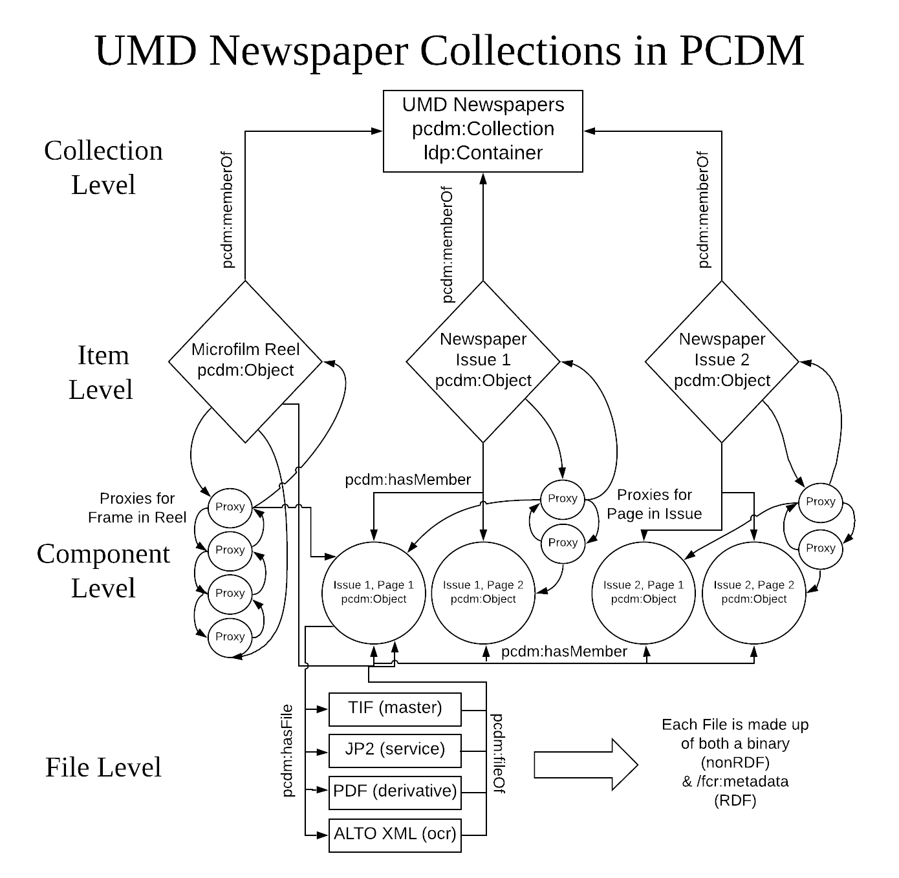

#

## Preliminaries

::: incremental

* Implementation pattern
* Practices that have worked for us
* Many other patterns might be possible

:::

::: notes

* Lest there be any confusion: I am not making any claims about "the right way"
* Fedora's flexibility means that it can be used/deployed in many ways
* Also non-trivial to deploy all services needed
* Hope is that this description can serve as a useful guide for others 

:::

<!-- Slide 2 -->

#

## Credit

::: incremental

* Fedora implementation team: 
    - Kate Dohe
    - Peter Eichman
    - Bria Parker
    - Ben Wallberg
    - Mohamed Abdul Rasheed
* Fedora Community

:::

::: notes

* Want to give credit where credit is due
* I'm the one sent here to present this, and opinions expressed are mine
* But the presentation is based on several years work by local team and community members
* Fcrepo Camel Toolbox, import/export, IIIF/Loris, Blacklight

:::

<!-- Slide 3 -->
#

    

::: notes

* This image depicts our stack and the applications and processes around it
* We consider three user types
* Fedora stack is blue
* Green are user-facing applications
* Yellow are processes
* Organize remarks around these processes

:::

# Import

<!-- Slide 4 -->
#

    

#

## Import: Plastron

::: incremental

* Python-based LDP client
* Support for PCDM content modeling
* Facilitates load from various layouts via handlers
* Uses Batch-Atomic feature
* Easy resumability
* Error handling/logging

:::

::: notes

* First thing we attacked was ingest
* This client was presented in Bozeman
* Currently refactoring to decorator-based pattern
* Best practices for us:
    * "tranactions" -- ensure object completeness
    * resumablity -- ensure data quality
    * make easy data handler development

:::

<!-- Slide 5 -->

#

    

#

## Import: Content Modeling

::: incremental

* Plastron applies models upon load
* Models built with:
    - PCDM
    - rdf:type (e.g. bibo:Letter)
* Item- and component-level objects
* Ordered and unordered components

:::

::: notes

* Model is applied at ingest, by handler
* Striving for declarative decorator-based 
* PCDM has been sufficient
* might be nice to distinguish item and component
* also whether order matters and what is the property that determines order

:::

# 

    

# 

    

<!-- Slide 6 -->

#

## Import: Repository Architecture

::: incremental

* Flat structure
* Avoids semantics in URIs / structure
* Second look at containment
* "Demoting" proxies to hash URIs?

:::

::: notes

* flat was seen as flexible
* WebAC inheritance makes containment at least convenient if not necessary
* ore:proxy resources are also full resources, looking to demote to hash uris
* currently some performance problems with this
* hash uri resources are a good solution for tightly-coupled resources

:::

<!-- Slide 7 -->

#

## Import: Performance Tuning

::: incremental

* Performance has been good
* Did require tuning
* Automated and asynchronous processing

:::

::: notes

* This is a place for speaker notes

:::

<!-- Slide 6 -->

#

## Messaging/Camel

::: incremental

* Camel facilitates asyncronicity
* We use Fcrepo Camel Toolbox
* Dropped messages have not been a problem
* ActiveMQ

:::

::: notes

* Camel allows us to push things like indexing to the background
* Response time that might be a problem in another context is fine
* System has been reliable, though by now there is some cleanup called for
* Management of these services requires ActiveMQ

:::

#

    

# Fixity

<!-- Slide 7 -->

#

## Repository Fixity

::: incremental

* Core repository function
* Fedora provides transmission and on-demand checks
* We added a service for periodic checking
* Populates a nightly queue with next 7000 URIs
* Stores results in triple store

:::

::: notes

* Preservation is not in software but is a process around how software is used
* It is about accountability so set it and forget it is not a viable option

:::

<!-- Slide 8 -->

#

## Record of Fixity Success

~~~ {.numberLines}
<foo> 
    premis:hasFixity 
    <foo#fixity/1511905188223> .
 
<foo#fixity/1511905188223> 
    a premis:EventOutcomeDetail, premis:Fixity ;
    premis:hasSize "379531"^^xsd:long ;
    premis:hasMessageDigest <urn:sha1:ff...51> ;
    premis:hasMessageDigestAlgorithm "SHA-1" ;
    premis:hasEventOutcome "SUCCESS" .
~~~

::: notes

* This is a record of fixity check success
* Generated as a message body that gets stored in triple store

:::

<!-- Slide 9 -->

#

## Record of Fixity Failure

~~~ {.numberLines}
<foo>
    premis:hasFixity
    <foo#fixity/1511905404576> .
 
<foo#fixity/1511905404576>
    a premis:EventOutcomeDetail, premis:Fixity ;
    premis:hasSize "379535"^^xsd:long ;
    premis:hasMessageDigest <urn:sha1:3c..db> ;
    premis:hasMessageDigestAlgorithm "SHA-1" ;
    premis:hasEventOutcome "BAD_SIZE" ;
    premis:hasEventOutcome "BAD_CHECKSUM" .
~~~

::: notes

* This is a record of fixity check failure
* Occurrence of failure event triggers email

:::

<!-- Slide 10 -->

#

## Storage of Audit Record

~~~ {.numberLines}
<foo> a premis:Event, audit:ExternalEvent, 
        prov:InstantaneousEvent ;
    premis:hasEventDateTime "{timestamp}" ;
    premis:hasEventType
        <http://id.loc.gov/.../eventType/fix> ;
    premis:hasEventRelatedObject <{target}> ;
    premis:hasEventOutcome earl:passed ;
    premis:hasEventOutcomeDetail 
        <{premis:Fixity resource}> .

{premis:Fixity resource from message body}
~~~

::: notes

* This is an example of how fixity events are stored
* (Apologies for the inscrutable RDF)
* We can query these records with SPARQL
* This is the framework on which a browse interface can be created
* Health dashboard (stats for resource types/numbers, fixity status)

:::

<!-- Slide 11 -->

#

## Fixity Statistics

::: incremental

* Running for close to 1 year
* Nearly 1 million file assets
* 2 fixity incidents so far 

:::

::: notes

* One error in 2 million checks
* 1 time a file was ingested, passed transmission fixity
* but file seems not to have made it to final location
* 1 TIF file has different checksum but not corrupt

:::

<!-- Slide 12 -->

#

    

# Export

#

## Export processes

::: incremental

* Capability URL service
* Community import/export tool
* Exported batches sent to APTrust
* Tracking database

:::

::: notes

* Capability URL service for any resource (one-time use download link)
* Export tool is part of our preservation workflow
* item-level export with recursion over properties
* Send bundles to APTrust
* Also developing a tracking database to track backup locations since this is out of scope for the repository

:::

<!-- Slide 13 -->
#

## Thank you for listening!

::: {.center}

Joshua A. Westgard 
University of Maryland Libraries  
westgard@umd.edu

:::
